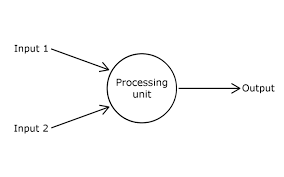

# AI

본 포스트에서 인공지능 기술 중 딥러닝에 대한 내용을 다뤄보기로 한다.




설명을 하기에 앞서 간단한 비유로 기본 구성 개념에 대해 표현한다.

위의 그림은 퍼셉트론이라는 기본 node로 딥러닝의 기본을 나타낸다. 우리의 몸에서 신경세포체라고 생각하면 된다. 여기에 Input과 Output을 통해 입출력값들은 우리 신경세포체의 시냅스에서 분비되는 신경전달 물질이라고 생각하면 되겠다.

--page-break--

## 경사하강법

HTML defines a long list of available inline tags, a complete list of which can be found on the [Mozilla Developer Network](https://developer.mozilla.org/en-US/docs/Web/HTML/Element).

* **To bold text**, use `<strong>`.
* _To italicize text_, use `<em>`.
* Abbreviations, like <abbr title="HyperText Markup Langage">HTML</abbr> should use `<abbr>`, with an optional `title` attribute for the full phrase.
* Citations, like <cite>&mdash; Thiago Rossener</cite>, should use `<cite>`.
* <del>Deleted</del> text should use `<del>` and <ins>inserted</ins> text should use `<ins>`.
* Superscript <sup>text</sup> uses `<sup>` and subscript <sub>text</sub> uses `<sub>`.

Most of these elements are styled by browsers with few modifications on our part.

--page-break--

# Neural Network

## Layer

​	깊어지면 깊어질수록

## Batch Size


#### Heading 4

Vivamus sagittis lacus vel augue rutrum faucibus dolor auctor. Duis mollis, est non commodo luctus, nisi erat porttitor ligula, eget lacinia odio sem nec elit. Morbi leo risus, porta ac consectetur ac, vestibulum at eros.

## Code

Cum sociis natoque penatibus et magnis dis `code element` montes, nascetur ridiculus mus.

```js
// Example can be run directly in your JavaScript console

// Create a function that takes two arguments and returns the sum of those arguments
var adder = new Function("a", "b", "return a + b");

// Call the function
adder(2, 6);
// > 8
```

Aenean lacinia bibendum nulla sed consectetur. Etiam porta sem malesuada magna mollis euismod. Fusce dapibus, tellus ac cursus commodo, tortor mauris condimentum nibh, ut fermentum massa.

## Lists

Cum sociis natoque penatibus et magnis dis parturient montes, nascetur ridiculus mus. Aenean lacinia bibendum nulla sed consectetur. Etiam porta sem malesuada magna mollis euismod. Fusce dapibus, tellus ac cursus commodo, tortor mauris condimentum nibh, ut fermentum massa justo sit amet risus.

* Praesent commodo cursus magna, vel scelerisque nisl consectetur et.
* Donec id elit non mi porta gravida at eget metus.
* Nulla vitae elit libero, a pharetra augue.

Donec ullamcorper nulla non metus auctor fringilla. Nulla vitae elit libero, a pharetra augue.

1. Vestibulum id ligula porta felis euismod semper.
2. Cum sociis natoque penatibus et magnis dis parturient montes, nascetur ridiculus mus.
3. Maecenas sed diam eget risus varius blandit sit amet non magna.

Cras mattis consectetur purus sit amet fermentum. Sed posuere consectetur est at lobortis.

Integer posuere erat a ante venenatis dapibus posuere velit aliquet. Morbi leo risus, porta ac consectetur ac, vestibulum at eros. Nullam quis risus eget urna mollis ornare vel eu leo.

## Images

Quisque consequat sapien eget quam rhoncus, sit amet laoreet diam tempus. Aliquam aliquam metus erat, a pulvinar turpis suscipit at.


## Tables

Aenean lacinia bibendum nulla sed consectetur. Lorem ipsum dolor sit amet, consectetur adipiscing elit.

<table>
  <thead>
    <tr>
      <th>Name</th>
      <th>Upvotes</th>
      <th>Downvotes</th>
    </tr>
  </thead>
  <tfoot>
    <tr>
      <td>Totals</td>
      <td>21</td>
      <td>23</td>
    </tr>
  </tfoot>
  <tbody>
    <tr>
      <td>Alice</td>
      <td>10</td>
      <td>11</td>
    </tr>
    <tr>
      <td>Bob</td>
      <td>4</td>
      <td>3</td>
    </tr>
    <tr>
      <td>Charlie</td>
      <td>7</td>
      <td>9</td>
    </tr>
  </tbody>
</table>

Nullam id dolor id nibh ultricies vehicula ut id elit. Sed posuere consectetur est at lobortis. Nullam quis risus eget urna mollis ornare vel eu leo.
